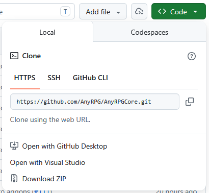

# Github Installation

## Install the Correct Unity Version

The AnyRPG Unity package is exported as a complete project because it requires specific build settings, compiler settings, layers, and tags to function. Due to the way full projects are exported in Unity, they must be imported with the **same or higher** Unity version they were exported with.

The correct Unity Version for the current github project is 6000.3.10f1 and can be downloaded from&#x20;

[https://unity3d.com/get-unity/download/archive](https://unity3d.com/get-unity/download/archive)

## Download the Project From Github

Choose one of the download methods that Github offers.

<figure><figcaption></figcaption></figure>

For example, you can clone the project into a directory on your computer if you have the [git CLI](https://git-scm.com/install/) installed using the command `git clone https://github.com/AnyRPG/AnyRPGCore.git`

<figure><figcaption></figcaption></figure>

## Open Unity Hub and Add the Project

Open Unity Hub and select the _Projects_ tab.  Click _Open > Add Project From Disk._

 (2).png>)

Find the project folder and choose _Add Project_.

## Open The Project

The project should now be visible in Unity Hub.  Click on it to open it.

<figure><figcaption></figcaption></figure>

## The Welcome Window

The welcome window should popup once the project opens.  If not, you can find it at **Tools -> AnyRPG -> Welcome Window**.

<figure><figcaption></figcaption></figure>

## Install TMP Essental Resources

Click the button Import TMP Essentials

<figure><figcaption></figcaption></figure>

When presented with the option, accept the defaults and click **Import**.

 (1).png>)

You should now see the warning has disappeared.

<figure><figcaption></figcaption></figure>

## Next Steps

Congratulations, AnyRPG is now ready to use!

From here you can [install optional addons](../managing-addons/), explore the [included sample games](../included-sample-games.md) or get started [creating your own game](../creating-your-first-game.md).
