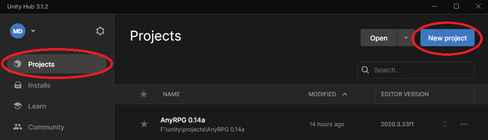

# Unity Asset Store Installation



## Find AnyRPG Core on the Unity Asset Store

AnyRPG Core can be found on the Unity Asset Store at [https://assetstore.unity.com/packages/slug/234361](https://assetstore.unity.com/packages/slug/234361)

## Install the Correct Unity Version

The AnyRPG Unity package is exported as a complete project because it requires specific build settings, compiler settings, layers, and tags to function. Due to the way full projects are exported in Unity, they must be imported with the **same or higher** Unity version they were exported with.

You can find the correct Unity version right on the asset store page.\

 (1).png>)

## Create a New Unity 3D Project

Open Unity Hub and select the _Projects_ tab.  Click _New project_.

If you have multiple versions of Unity installed, you will need to select the correct editor version.  Choose 3D (URP/HDRP are not available yet), optionally name your project, and click the _Create project_ button.

.png>)

## Install the AnyRPG Unity Package

Add the AnyRPG Core asset to your assets by clicking the **Add To My Assets** button on the asset store page.

.png>)

Once the asset is added to your assets, click the **Open in Unity** button.

.png>)

When the package manager opens in Unity, click the Download button to download the package.

.png>)

Once the package has downloaded, the **Import** button should become available.  Click it.

A warning window will pop up letting you know this package will overwrite all project settings.  Click **Import**.

.png>)

A warning window will pop up prompting you to upgrade package manager dependencies.  This is necessary to ensure that packages that AnyRPG relies on, such as the Post Processing package are installed.  Click **Install/Upgrade**.

 (2).png>)

When the Import Unity Package window appears, click **Import**.

.png>)

The AnyRPG Unity package contains hundreds of textures, icons, 3d models, and audio files.  You can expect the import to take a few minutes, even on a reasonably fast computer.

.png>)

Once the import completes, you will see errors in the console.  These will be fixed in the next step by installing UMA.

 (2).png>)

## Install UMA 2

Install UMA 2 from the Unity Asset Store at [https://assetstore.unity.com/packages/3d/characters/uma-2-unity-multipurpose-avatar-35611](https://assetstore.unity.com/packages/3d/characters/uma-2-unity-multipurpose-avatar-35611)

If you don't already own UMA, click _Add to My Assets_.

.png>)

Click _Open in Unity_.

.png>)

The Unity Package Manager should open in Unity.  If you have not downloaded the package yet, click **Download**.  Then Click **Import**.

 (2) (4).png>)

When presented with the option, accept the defaults and click **Import**.

.png>)

Since UMA has not been updated to the new 2021 API yet, you will have to accept the script update.  Click **Yes, just for these files**.\
 (8).png>)

After the UMA package is imported, click **Clear** in the Console pane to clear any old warnings.

.png>)

You should no longer see any errors.

.png>)

Finally, rebuild the UMA Global Library.  Choose from the main menu bar _UMA > Global Library_.

.png>)

In the Global Library window, choose _File > Rebuild From Project_.

.png>)

## Install TMP Essental Resources

Open the Window menu in Unity and choose _TextMeshPro > Import TMP Essential Resources_.

 (2).png>)


AnyRPG Includes a modified version of the Liberation Sans SDF Asset so be sure to **uncheck** the box beside AnyRPG before clicking _Import_.


.png>)

## Next Steps

Congratulations, AnyRPG is now ready to use!

From here you can explore the [included sample games](../included-sample-games.md) or get started [creating your own game](../creating-your-first-game.md).
