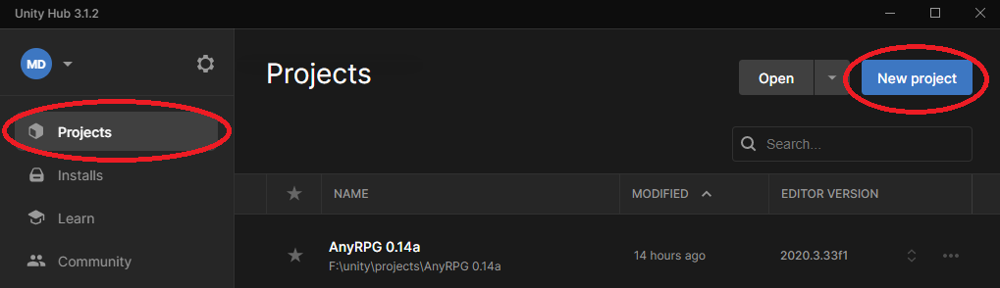

# Unity Asset Store Installation



## Find Any(MMO)RPG on the Unity Asset Store

Any(MMO)RPG can be found on the Unity Asset Store at [https://assetstore.unity.com/packages/slug/234361](https://assetstore.unity.com/packages/slug/234361)

## Install the Correct Unity Version

The Any(MMO)RPG Unity package is exported as a complete project because it requires specific build settings, compiler settings, layers, and tags to function. Due to the way full projects are exported in Unity, they must be imported with the **same or higher** Unity version they were exported with.

You can find the correct Unity version right on the asset store page.

## Create a New Unity 3D Project

Open Unity Hub and select the _Projects_ tab.  Click _New project_.

If you have multiple versions of Unity installed, you will need to select the correct editor version.  Choose Universal 3D (SRP), optionally name your project, and click the _Create project_ button.

<figure><figcaption></figcaption></figure>

## Install the Any(MMO)RPG Unity Package

Add the Any(MMO)RPG asset to your assets by clicking the **Add To My Assets** button on the asset store page.

<figure><figcaption></figcaption></figure>

Once the asset is added to your assets, click the **Open in Unity** button.

<figure><figcaption></figcaption></figure>

When the package manager opens in Unity, click the Download button to download the package.

<figure><figcaption></figcaption></figure>

Once the package has downloaded, the **Import** button should become available.  Click it.

<figure><figcaption></figcaption></figure>

A warning window will pop up letting you know this package will overwrite all project settings.  Click **Import**.

 (2) (1) (1).png>)

When the Import Unity Package window appears, click **Next**.

<figure><figcaption></figcaption></figure>

Click **Import**.

<figure><figcaption></figcaption></figure>

The Any(MMO)RPG Unity package contains hundreds of textures, icons, 3d models, and audio files.  You can expect the import to take a few minutes, even on a reasonably fast computer.

.png>)

## The Welcome Window

The welcome window should popup once the project opens.  If not, you can find it at **Tools -> AnyRPG -> Welcome Window**.

<figure><figcaption></figcaption></figure>

## Install TMP Essental Resources

Click the button Import TMP Essentials

<figure><figcaption></figcaption></figure>

When presented with the option, accept the defaults and click **Import**.

 (1).png>)

You should now see the warning has disappeared.

<figure><figcaption></figcaption></figure>

## Next Steps

Congratulations, AnyRPG is now ready to use!

From here you can [install optional addons](../managing-addons/), explore the [included sample games](../included-sample-games.md) or get started [creating your own game](../creating-your-first-game.md).
