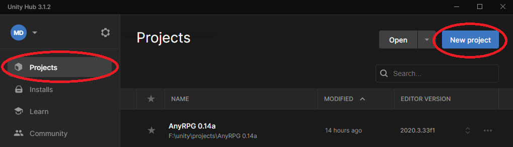

# Unity Package Installation

## Download AnyRPG

Download the AnyRPG Unity package from [https://www.anyrpg.org/downloads/](https://www.anyrpg.org/downloads/).

## Install the Correct Unity Version

The AnyRPG Unity package is exported as a complete project because it requires specific build settings, compiler settings, layers, and tags to function. Due to the way full projects are exported in Unity, they must be imported with the **same** Unity version they were exported with.

You can find the correct Unity version for the latest unity package right on the downloads page, and the correct Unity version for previous AnyRPG packages on their individual details pages.\
.png>).png>)

## Create a New Unity 3D Project

Open Unity Hub and select the _Projects_ tab.  Click _New project_.

If you have multiple versions of Unity installed, you will need to select the correct editor version.  Choose 3D (URP/HDRP are not available yet), optionally name your project, and click the _Create project_ button.

.png>)

## Install the AnyRPG Unity Package

When project loads, find the AnyRPG Unity package on your hard drive, and drag it into the Project pane or tab in the Unity editor.\
.png>)

A warning window will pop up letting you know this package will overwrite all project settings.  Click _Import_.

 (1).png>)

When the Import Unity Package window appears, click _Import_.

.png>)

The AnyRPG Unity package contains thousands of textures, icons, 3d models, and audio files.  You can expect the import to take around 10 minutes, even on a reasonably fast computer.

.png>)

When the installation completes, your project should have the following folder structure.

.png>)

You can safely ignore any warning messages in the console.  There should be no error messages.  If there are error messages, check to ensure you created the project with the correct version of Unity.

.png>)

## Next Steps

From here you can explore the [included sample games](../included-sample-games.md) or get started [creating your own game](../creating-your-first-game.md).
