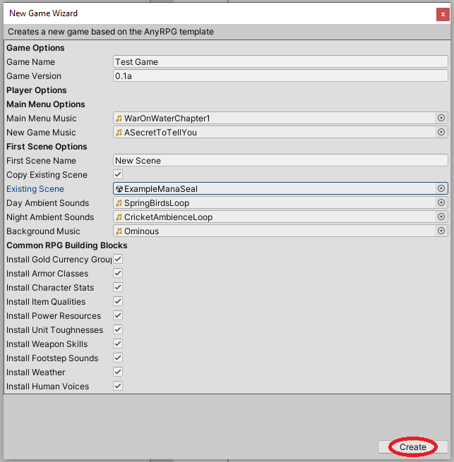

# Achievement



## Creation

To create an achievement, find (or create) the _GameName/Resources/GameName/Achievement_ folder in the project tab and right click.  Choose _Create > AnyRPG > Achievement_.

## Properties

| Name                    | Description                                                                                                                               |
| ----------------------- | ----------------------------------------------------------------------------------------------------------------------------------------- |
| Steps                   | A list of steps, with [Objectives](quest.md#quest-objectives) for each step, that must be completed in order to complete the achievement. |
| Prerequisite Conditions | A list of [Prerequisite Conditions](../shared-properties/prerequisite-conditions.md) that must be met to start the achievement.           |
