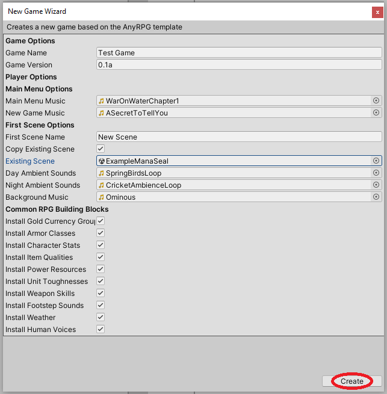

# Weather Profile



## Creation

To create a weather profile, find (or create) the _GameName/Resources/GameName/WeatherProfile_ folder in the project tab and right click.  Choose _Create > AnyRPG > WeatherProfile_.

## Properties

| Name                    | Description                                                                                                                                                                                                                                                               |
| ----------------------- | ------------------------------------------------------------------------------------------------------------------------------------------------------------------------------------------------------------------------------------------------------------------------- |
| Prefab Profile          | A prefab profile containing a weather prefab to spawn.                                                                                                                                                                                                                    |
| Suppress Ambient Sounds | If true, regular day/night ambient sounds will not be played while this weather effect is active.                                                                                                                                                                         |
| Ambient Sounds Profile  | Ambient sounds to play in the background while this weather is active. These will override any normal ambient sounds for the scene.                                                                                                                                       |
| Ambient Sounds Audio    | Ambient sounds to play in the background while this weather is active. This will override any audio profile chosen as well as any normal ambient sounds for the scene.                                                                                                    |
| Shadow Strength         | This number will be multiplied by the default shadow strength of the sun to give a relative shadow strength while the weather is active.                                                                                                                                  |
| Fog Settings            | 
Settings that will override the default environmental fog settings for the scene. <strong>Use Fog</strong> If true, fog will be turned on. <strong>Fog Color</strong> The color of the fog. <strong>Fog Density</strong> The density of the fog.
 |

## Next Steps

* Add a weather profile to a [Scene Node](scene-node.md) to allow the weather to play in that scene.

